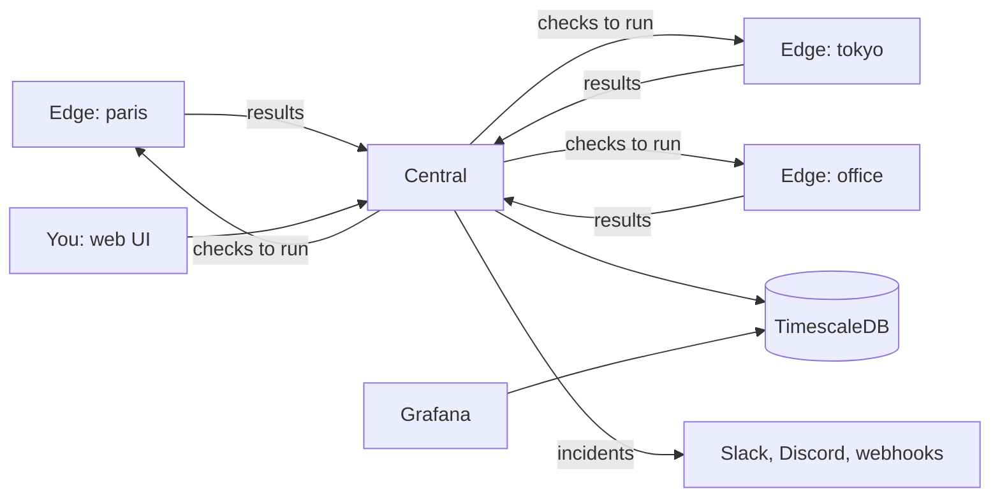

# netprobe

**Measure your network from the places that matter, and be told when it breaks.**

[](https://github.com/Arylite/netprobe/actions/workflows/ci.yml)
[](https://github.com/Arylite/netprobe/actions/workflows/codeql.yml)
[](https://github.com/Arylite/netprobe/releases)
[](LICENSE)

[Documentation](docs/README.md) | [Getting started](docs/getting-started.md) | [Concepts](docs/concepts.md) | [Releases](https://github.com/Arylite/netprobe/releases)

## What it is

A website can be up for you and down for a colleague in another city. netprobe puts a small
program, an **edge**, on each machine you want to measure from. Each edge runs **checks** (can I
open this site? does this name resolve? is this certificate about to expire?) and reports to a
**central**, which keeps the history, opens an **incident** when something stays wrong, and tells
Slack, Discord or your own webhook.



## Try it in two minutes

You need Docker.

```sh
docker compose up -d
docker compose logs central | grep setup_code     # six digits
```

Open <https://localhost> (the proxy makes a certificate with its own authority: your browser warns
once), give the code, and create the administrator. The home page then guides the first steps:
register an edge, add a check, add a channel.

The full walk-through, step by step, is in [Getting started](docs/getting-started.md).

## On a real server

One command on a Linux machine, for the central or for an edge (the
[guide](docs/install.md) says how to read the script first):

```sh
curl -fsSL https://github.com/Arylite/netprobe/releases/download/v1.1.0/install.sh | sudo sh -s -- central --domain netprobe.example.com
curl -fsSL https://github.com/Arylite/netprobe/releases/download/v1.1.0/install.sh | sudo sh -s -- edge --central https://netprobe.example.com
```

## What you get

| | |
|---|---|
| **Eleven kinds of check** | TCP, HTTP (status and content), DNS, TLS certificate, ICMP ping, traceroute, NTP clock, service banner, closed port, download speed, domain expiry; every second at best |
| **Edges that only dial out** | no open port, works behind any firewall, one revocable token each |
| **Incidents and alerts** | opened when a check keeps failing or an edge goes quiet; signed webhooks |
| **A web UI to manage it** | edges, checks, channels, users, incidents, audit log |
| **Grafana to look at it** | three dashboards, already connected, with image rendering |
| **Storage that lasts** | PostgreSQL with TimescaleDB, compressed after 7 days, kept as long as you say |
| **Security by default** | TLS 1.3, client certificates, argon2id, encrypted secrets, audit trail |
| **Easy to diagnose** | a `doctor` command on both sides that says what is wrong |
| **Easy to ship** | binaries for linux (amd64, arm64), macOS (arm64), windows (amd64); images for amd64 and arm64, scanned before they are published |

## Learn more

| I want to | Read |
|---|---|
| understand the ideas first | [Concepts](docs/concepts.md) |
| choose what to measure | [Checks](docs/checks.md) |
| add an edge on another machine | [Edges](docs/edges.md) |
| get a message in Slack | [Alerts](docs/alerting.md) |
| put it on a server with a real name | [Deploying](docs/deploy.md) |
| back it up and upgrade it | [Operating](docs/operations.md) |
| look up a setting | [Configuration](docs/configuration.md) |
| understand how it is built | [Architecture](docs/architecture.md) |
| know what it protects | [Security](docs/security.md) |
| build and contribute | [Development](docs/development.md) |

Everything is listed in the [documentation home](docs/README.md).

## Status

Version 1.1.0. To report a vulnerability, see [SECURITY.md](SECURITY.md).

License: Apache 2.0. See [LICENSE](LICENSE).
