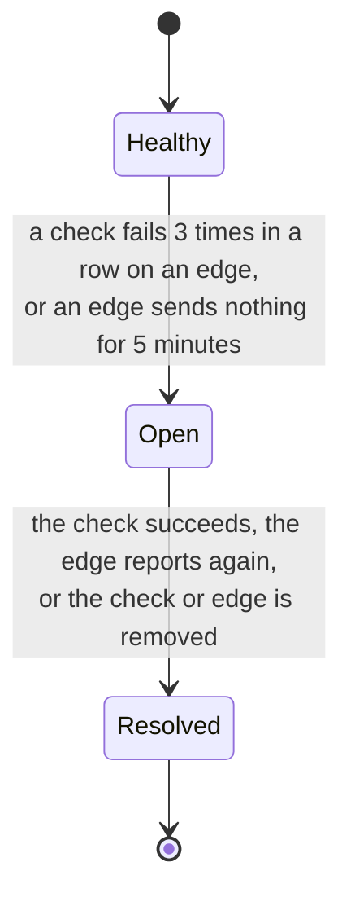

[Docs](README.md) / Set it up

# Alerts

netprobe opens an **incident** when something stays wrong, and tells your **channels** when it
opens and when it ends. A channel is a webhook.

> **Level:** beginner for Slack and Discord, advanced for signatures | **Time:** 10 minutes



Each incident belongs to one check on one edge (or to one edge that went quiet). A site that is
down for everyone opens one incident per edge, and a fault in one edge's network opens only that
one.

## Get a message in Slack

The shortest path:

1. Create an *Incoming Webhook* in Slack and copy its URL.
2. In the web UI, **Channels**, then **Add a channel**: give a name and the URL.
3. Press **Test**. A message arrives at once.

The same from the command line:

```sh
printf '%s\n' 'the secret' | netprobe-central channel add --name ops --url https://hooks.example.com/x --secret-stdin
netprobe-central channel test --name ops
```

Leave the secret empty for chat tools; the address is their secret.

## Slack, Discord, Mattermost

The body carries a `text` that reads as a sentence, which chat tools with incoming webhooks
accept as it is:

| Tool | The address to give |
|---|---|
| Slack | the webhook URL of an *Incoming Webhook* app: `https://hooks.slack.com/services/T000/B000/XXXX` |
| Discord | the webhook URL of the channel (*Edit channel*, *Integrations*, *Webhooks*) **with `/slack` added**: `https://discord.com/api/webhooks/ID/TOKEN/slack` |
| Mattermost | the *Incoming Webhook* URL: `https://chat.example.com/hooks/XXXX` |
| Rocket.Chat | the *Incoming WebHook* URL; it takes `text` too |

## How channels behave

- A channel only hears of incidents that start after it was added.
- A message is sent until the channel answers 2xx, and no longer than an hour after the event: an
  alert that comes late is not an alert. A channel that fails does not hold back the others.
- A resolution goes only to channels that heard the incident open.
- The addresses are checked: a webhook cannot reach loopback, link-local or cloud metadata
  addresses (`NETPROBE_WEBHOOK_DENY` changes that). Secrets are encrypted in the database with
  the key in the `secrets` volume.

## Tuning when an incident opens

| What | Default | Setting |
|---|---|---|
| Failed runs in a row | 3 | `NETPROBE_ALERT_FAILURES` |
| Silence of an edge | 5 minutes | `NETPROBE_EDGE_SILENCE` |
| How often the central looks | 30 seconds | `NETPROBE_ALERT_INTERVAL` |

With Docker, put them in `compose.override.yaml`, next to `compose.yaml`:

```yaml
services:
  central:
    environment:
      NETPROBE_ALERT_FAILURES: "2"
      NETPROBE_EDGE_SILENCE: 3m
```

Then `docker compose up -d`.

> [!TIP]
> The time to notice a failure is about *failures x interval* of the check, so a check that runs
> every 5 minutes with 3 failures says so after 15. Run important checks more often rather than
> lowering the count, which makes a single lost packet an alert. With several centrals on one
> database, one evaluates at a time.

## Good practice

- Add at least two channels in two places, so that one tool being down does not silence the
  other.
- A check that cannot succeed (for example `example.com:81`) opens an incident after three runs:
  use one to see the whole path work, then remove it.
- The **Incidents** page and `netprobe-central incident list` show what is open and what was.

## For your own receiver: the body and the signature

Anything that accepts an HTTP POST with JSON can be a channel.

```json
{
  "event": "opened",
  "text": "[netprobe] web on paris is failing: 3 failures in a row, last: connection refused",
  "incident": { "id": 12, "kind": "check", "check_id": "web", "edge_id": "1a08...", "edge": "paris",
                "started_at": "2026-10-07T09:12:00Z", "detail": "3 failures in a row, last: connection refused" }
}
```

`event` is `opened`, `resolved` or `test`. `incident.kind` is `check` or `edge`. A resolved
incident also has `resolved_at` and a `resolution`.

With a secret, each request carries two headers:

- `X-Netprobe-Timestamp`: the time, in seconds since 1970;
- `X-Netprobe-Signature`: `sha256=` and the hex HMAC-SHA256, keyed by the secret, of the
  timestamp, a dot and the raw body.

A receiver must recompute it on the **raw** body (not on a parsed and written again one), compare
in constant time, and refuse a timestamp that is not recent, so that a captured message cannot be
sent again.

Python:

```python
import hashlib, hmac, time

def verify(secret: bytes, body: bytes, timestamp: str, signature: str, tolerance: int = 300) -> bool:
    if abs(time.time() - int(timestamp)) > tolerance:
        return False
    expected = "sha256=" + hmac.new(secret, timestamp.encode() + b"." + body, hashlib.sha256).hexdigest()
    return hmac.compare_digest(expected, signature)
```

Node.js:

```js
const crypto = require("node:crypto");

function verify(secret, body, timestamp, signature, tolerance = 300) {
  if (Math.abs(Date.now() / 1000 - Number(timestamp)) > tolerance) return false;
  const expected = "sha256=" + crypto.createHmac("sha256", secret).update(`${timestamp}.`).update(body).digest("hex");
  const a = Buffer.from(expected);
  const b = Buffer.from(signature);
  return a.length === b.length && crypto.timingSafeEqual(a, b);
}
```

> [!IMPORTANT]
> Answer with a 2xx as soon as the message is accepted, and do the work after: the sender waits a
> few seconds and then tries again.

---

Previous: [Checks](checks.md) | Next: [Grafana](grafana.md)
