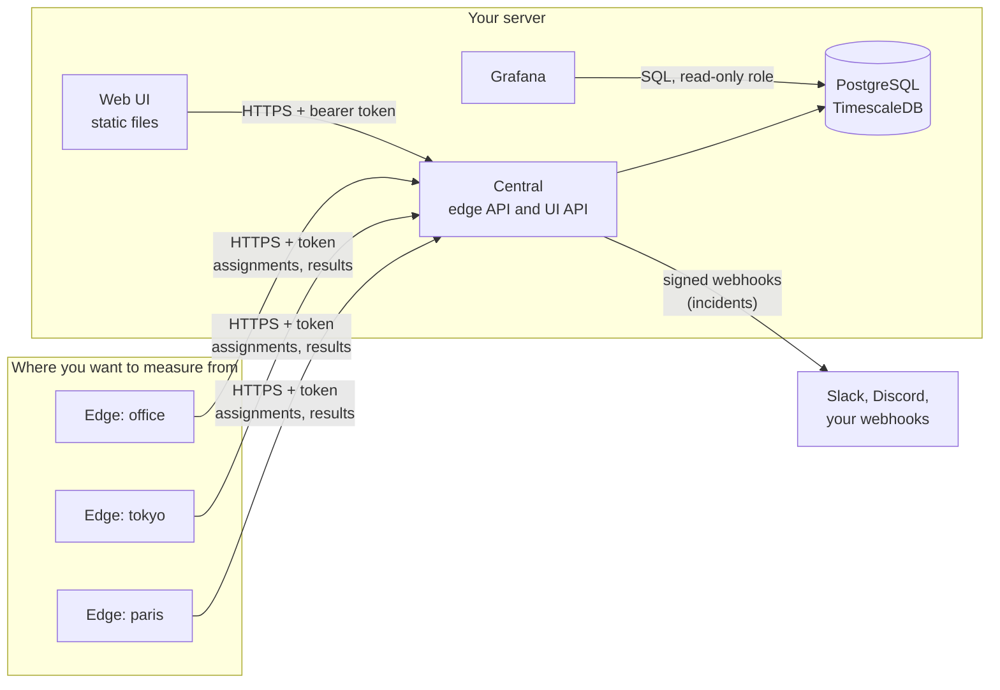
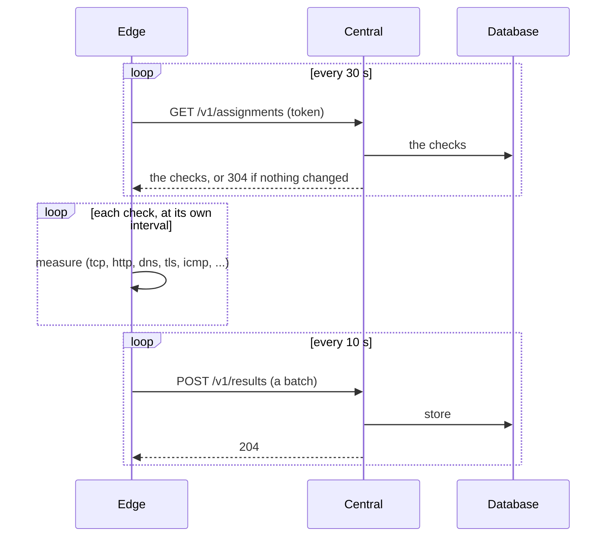

[Docs](README.md) / Go deeper

# Architecture

How the parts of netprobe fit together, and how the code is organised.

> **Level:** advanced | **Read first:** [Concepts](concepts.md)

## The parts



An edge only dials out, and one poll is also its heartbeat:



## Design choices

| Choice | Why |
|---|---|
| The central serves two APIs and no files: the edge API, and an API for the web UI described by an OpenAPI document it publishes itself | the UI is a separate client, hosted anywhere (static files, its own server), and talks to the central like any other client |
| Edges only dial out: they poll `GET /v1/assignments` and post results in batches | plain HTTPS and JSON passes any reverse proxy and can be tested with curl |
| One token per edge, stored hashed, revocable | a lost machine costs one token |
| The address of a client comes from the connection, or from `X-Forwarded-For` when the connection comes from a proxy named in `--trusted-proxies` | no STUN, and no header believed from strangers |
| The two APIs are separate listeners | they can face different networks: the edge API on the internet, the UI API on an intranet |
| The UI API authenticates with bearer tokens, not cookies, and answers only the origins it is told to | nothing for another site to forge |
| Configuration comes from environment variables, with the same names everywhere | one way to set things, in Docker or not |
| A `doctor` command on both sides | it checks DNS, TLS, token, clock, database and proxies, and says what is wrong |

## The code

```
cmd/netprobe-central    server entry point and its commands
cmd/netprobe-edge       agent entry point
e2e                     edge and central tested together
deploy                  the proxy, web server and database images, an edge compose file
internal/api            wire contract between edge and central
internal/cli            environment defaults and logging for the commands
internal/probe          network measurements and the policy on what they may reach
internal/edge           the agent: scheduler, buffer, central client
internal/central        the server: edge API, doctor
internal/central/store   PostgreSQL: migrations, edges, checks, results, users, incidents
internal/central/auth    passwords (argon2id), policy, login throttling, trusted proxies
internal/central/webapi  the UI API: sessions, roles, CORS, endpoints, OpenAPI
internal/central/alert   incidents from failing checks and silent edges, webhooks
web                     the management UI: React, built to static files
```

Dependencies go one way: `cmd` -> `edge` or `central` -> `probe` -> `api`. `api` imports no other
package of the project, `probe` only `api`, and `edge` and `central` never import each other
(only `e2e` imports both, in tests).

## Data

Everything lives in PostgreSQL with TimescaleDB. Results go to a hypertable, `results`
(`edge_id`, `check_id`, `at`, `ok`, `rtt_millis`, `error`), compressed after 7 days and kept for
ever unless a retention is set. The central applies its migrations on start, and brings the
TimescaleDB extension to the version of the server; the extension must be creatable by the
database user. See [Grafana](grafana.md#where-the-data-comes-from).

---

Previous: [Operating](operations.md) | Next: [Configuration](configuration.md)
