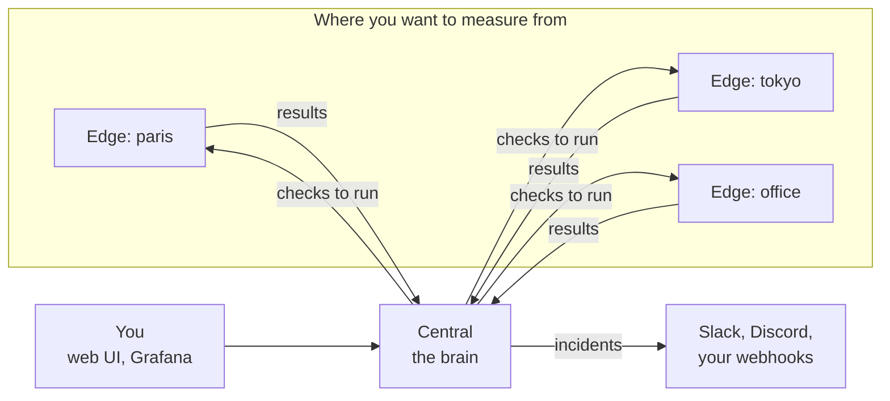
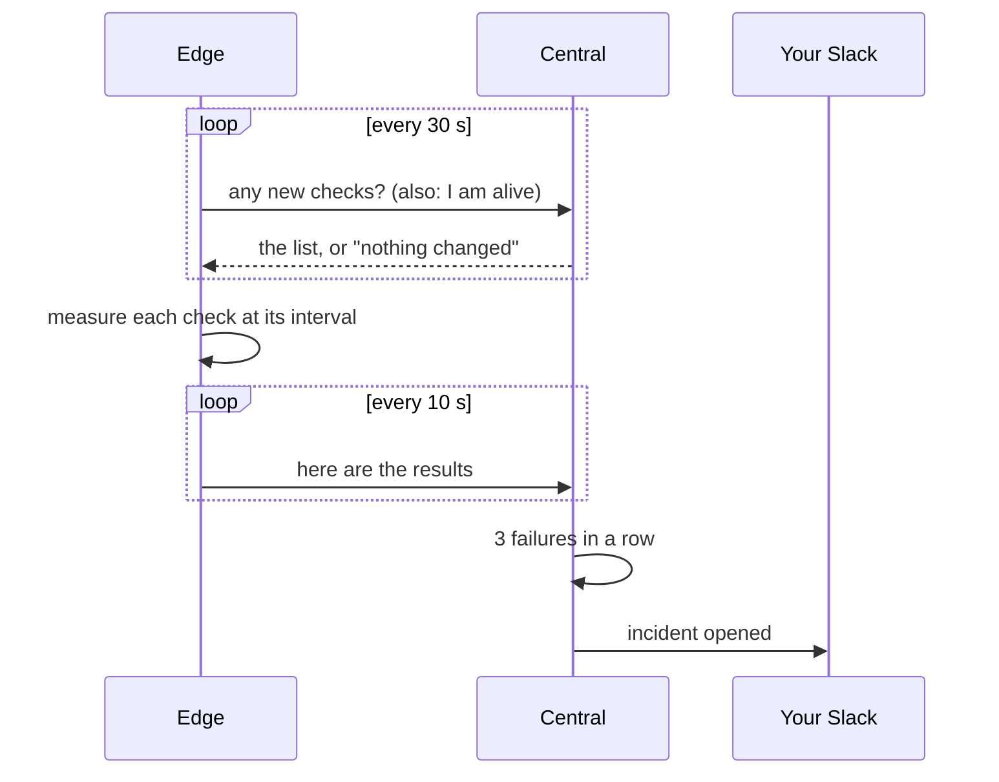

[Docs](README.md) / Start here

# Concepts

netprobe answers one question: **is the network fine, as seen from where my machines are?**

> **Level:** beginner | **Reading time:** 5 minutes | **Commands:** none

## The idea in one minute

A website can be up for you and down for your colleagues in another city. To know, you need to
look from their side. So netprobe puts a small program on each of those machines. Each one
tests things (can I open this site? does this name resolve?) and reports to one place that
keeps the history and warns you.

## The five words

| Word | What it is | Think of it as |
|---|---|---|
| **Edge** | a small program on a machine; it runs checks from where it stands | a sensor |
| **Central** | the server that tells edges what to do, stores results and raises alerts | the control room |
| **Check** | one measurement, such as "open a connection to `example.com:443`" | a question you ask |
| **Incident** | a problem that stays: a check keeps failing, or an edge goes quiet | an alarm |
| **Channel** | a webhook that is told when an incident opens or ends | a phone number to call |

Two things follow from this and are worth remembering:

- **Every edge runs every check.** Add one check and you get one answer per edge. That is how
  you tell "the site is down" from "only the network of Tokyo is".
- **An edge only dials out.** It needs no open port, so it works behind a firewall or a home
  router.

## A check, from start to finish

1. You add a check in the web UI: kind `http`, target `https://example.com`, every 30 seconds.
2. Within 30 seconds each edge learns about it.
3. Each edge runs it at its own pace and sends the results in small batches, every 10 seconds.
4. The central stores them. You see them in the web UI and in Grafana.
5. If the check fails three times in a row on an edge, the central opens an **incident** and
   sends a message to your channels. When it works again, the incident ends and you get a
   second message.

## Who does what

| You want to | Use |
|---|---|
| add or remove edges, checks, channels and users; see what is failing now | the **web UI** |
| look at history, response times and trends | **Grafana** (already connected) |
| script something, or work on a server | the **command line** or the **API** |
| find out why a machine cannot reach the central | the `doctor` command |

The web UI is for managing and Grafana is for looking at charts. They do not overlap.

## Things people often ask

**How long do things last?**
An edge token does not expire: it works until you revoke it. A login to the web UI lasts
12 hours by default, then you sign in again (`NETPROBE_SESSION_TTL` changes it). Results are
kept until you set a retention, and compressed after 7 days.

**What if the central is unreachable?**
Edges keep measuring and hold up to 10,000 results in memory, then send them when the central
is back.

**What can an edge reach?**
Anything on the network except loopback, link-local and cloud metadata addresses, because the
central decides what edges probe and must not be able to turn them against their own machine.
Private networks are allowed: measuring an intranet is the point.
See [Edges](edges.md#what-an-edge-may-reach).

**Where is the data?**
In one PostgreSQL database with the TimescaleDB extension. Back that up ([Operating](operations.md)).

## Where to go next

- [Getting started](getting-started.md): run it and see your first result.
- [Checks](checks.md): the eleven kinds of measurement.
- [Architecture](architecture.md): the details behind the picture above.

---

Next: [Getting started](getting-started.md)
