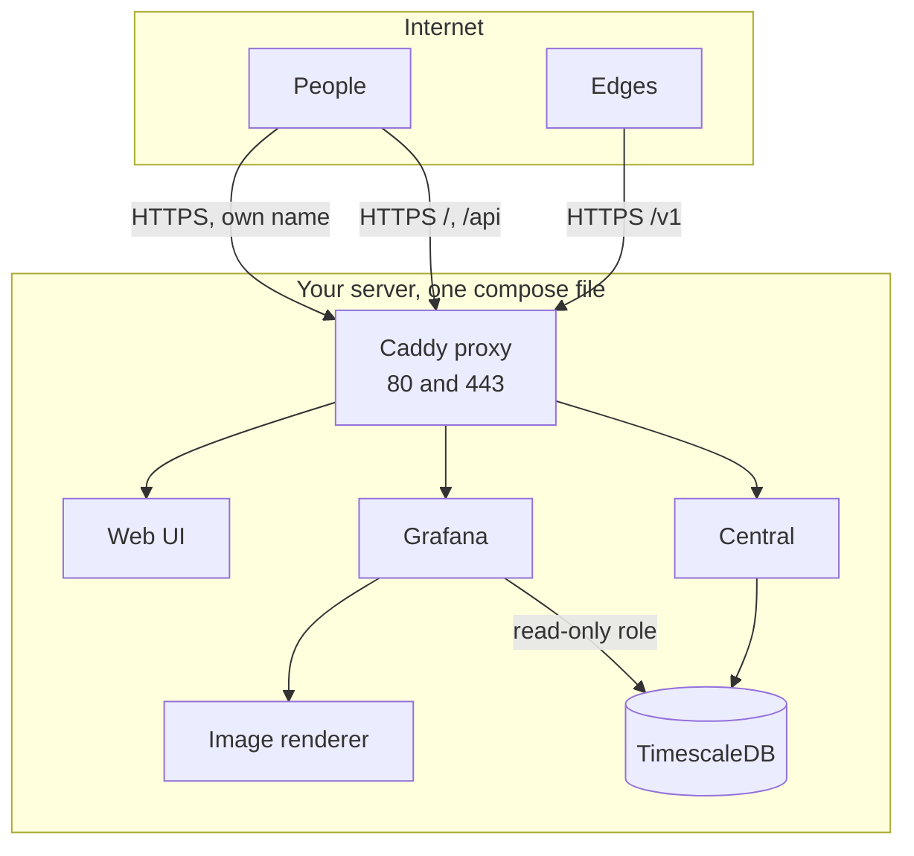

[Docs](README.md) / Set it up

# Deploying

How to run netprobe on a server that other machines can reach. The compose file does the work;
this guide is about the choices around it: names, certificates, and whether to open ports or use
a Cloudflare Tunnel.

> **Level:** intermediate | **Time:** 20 minutes | **You need:** a server with Docker, and a domain



## What you need

- A machine with Docker and the compose plugin, 2 GB of memory or more.
- Two names that point at it, for example `netprobe.example.com` for the UI and the edges, and
  `netprobe-grafana.example.com` for Grafana. Any names do, as long as the settings below say
  them. Grafana has a name of its own, not a path under the UI, so that nothing it runs shares the
  origin of the UI.
- Ports 80 and 443 open, unless you use a tunnel.

> [!TIP]
> **In one command.** `install.sh central` does what follows, with open ports or a tunnel
> (`--tunnel`): see [Installing with the script](install.md). The rest of this guide is the same
> thing by hand.

## Choose how people reach it

| | Open ports | Cloudflare Tunnel |
|---|---|---|
| Ports open on the server | 80 and 443 | none |
| Certificates | Caddy gets them from Let's Encrypt | Cloudflare holds them |
| Best when | the server is reachable from the internet | the server is behind NAT or a strict firewall |
| Jump to | [below](#with-open-ports-caddy-and-lets-encrypt) | [below](#with-a-cloudflare-tunnel-no-open-port) |

## With open ports: Caddy and Let's Encrypt

Copy `.env.example` to `.env` and set the names:

```sh
NETPROBE_DOMAIN=netprobe.example.com
NETPROBE_PUBLIC_URL=https://netprobe.example.com
NETPROBE_GRAFANA_DOMAIN=netprobe-grafana.example.com
NETPROBE_GRAFANA_URL=https://netprobe-grafana.example.com
```

Start it, and read the setup code from the log:

```sh
docker compose up -d
docker compose logs central | grep setup_code
```

Caddy gets a certificate for each name by itself, and renews it. That needs the names to point at
the server and ports 80 and 443 to reach it. Open the UI, give the code, and create the
administrator. Edges then use `https://netprobe.example.com`: no `--ca-file` is needed, the
certificates are public ones.

## With a Cloudflare Tunnel: no open port

A tunnel makes the server dial out to Cloudflare, so nothing listens on the internet. **One
tunnel carries both names.** Cloudflare holds the certificates, and the proxy listens in plain
HTTP on two ports that only the compose network reaches: `8088` for the UI and the edge API,
`8089` for Grafana.

1. In the Cloudflare dashboard (Zero Trust, then Networks, then Tunnels), create a tunnel of the
   type *Cloudflared*. Copy its token, the long string of the install command after `--token`,
   into a file next to `compose.yaml`:

   ```sh
   printf '%s' 'eyJhIjoi...' > cloudflared_token
   ```

2. In the tunnel, add two **public hostnames**. They are the only place the two services are told
   apart:

   | Public hostname | Service |
   |---|---|
   | `netprobe.example.com` | `HTTP` `proxy:8088` |
   | `netprobe-grafana.example.com` | `HTTP` `proxy:8089` |

   Cloudflare makes the DNS records for them.

3. In `.env`, say where people will find each one, and keep the proxy off the network:

   ```sh
   NETPROBE_BIND=127.0.0.1
   NETPROBE_PUBLIC_URL=https://netprobe.example.com
   NETPROBE_GRAFANA_URL=https://netprobe-grafana.example.com
   ```

   Leave `NETPROBE_DOMAIN` and `NETPROBE_GRAFANA_DOMAIN` as they are: they are the names Caddy
   asks Let's Encrypt for, and with a tunnel it has no use for one.

4. Start it with the profile:

   ```sh
   docker compose --profile cloudflared up -d
   ```

Edges use `https://netprobe.example.com`, as with open ports. The central believes
`X-Forwarded-For` from the `cloudflared` container, and from it alone, so the audit trail and the
failure limits see the real address of each person.

> [!NOTE]
> **About the names.** Any two hostnames work. Cloudflare's free certificate covers the domain
> and *one* level of subdomain: `netprobe-grafana.example.com` and `grafana.example.com` are
> covered, `grafana.netprobe.example.com` is not (it needs Cloudflare's advanced certificates).
> If you want that shape, take them, and set the two `*_URL` settings to it; the rest does not
> change.

> [!WARNING]
> **Who may see them.** A tunnel makes both names public. Put Cloudflare Access in front of
> `netprobe-grafana.example.com`, and of `netprobe.example.com` with a rule that lets `/v1/*` and
> `/healthz` through without a login: edges call those paths, and authenticate with their token.

## Keeping the UI on a private network

The edge API has to be reachable by every edge. The UI and Grafana do not. Say who may see them
in `.env`, with addresses and ranges, or `private_ranges` for the ones of a private network:

```sh
NETPROBE_UI_ALLOW=private_ranges
# or: NETPROBE_UI_ALLOW=203.0.113.0/24 198.51.100.7
```

Anyone else gets a 404 for the UI, its API and Grafana, and the edge API (`/v1` and `/healthz`)
stays open to the edges with a token. Apply it with `docker compose up -d proxy`. With a tunnel,
the address is the one that `cloudflared` reports, so a range of your own office works there too.

## Serving the TLS yourself

If you have a certificate and do not want the proxy, the central can serve TLS 1.3 on each
surface (`--edge-tls-cert`, `--api-tls-cert` and their keys), reloads a renewed certificate
without a restart, and can ask every edge for a certificate signed by your authority
(`--edge-client-ca`). See [Security](security.md#transport). Then run the central alone, with its
database, from the binaries or from the `central` image.

## Before you go live

- [ ] The names point at the server, and the certificates are issued (`docker compose logs proxy`).
- [ ] The administrator exists and the setup code is no longer needed.
- [ ] `docker compose exec central /netprobe-central doctor` shows no failure.
- [ ] A channel is added and its **Test** arrives.
- [ ] The secrets are backed up: the `db-data`, `secrets` and `grafana-secrets` volumes, or a dump
      and the two secrets volumes (see [Operating](operations.md)). Without the key in `secrets`,
      the channels cannot be read again.
- [ ] You know the password of Grafana:
      `docker compose exec grafana cat /grafana-secrets/grafana_admin_password`.
- [ ] `NETPROBE_RETENTION` says how long you want the results.
- [ ] For a tunnel, Cloudflare Access protects what should not be public.

---

Previous: [Grafana](grafana.md) | Next: [Operating](operations.md)
