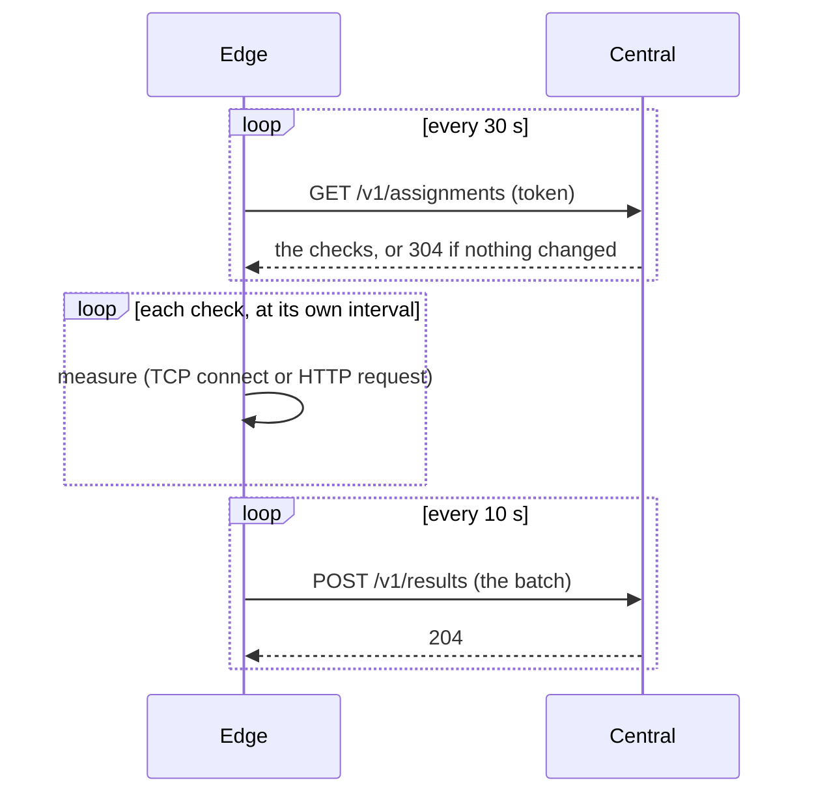

# Edges

An edge is a small program on a machine. It measures the network from where that machine
stands, and tells the central. Put one wherever you want to know how the network looks:
a branch office, a data centre, a laptop.



The edge only dials out: it needs no open port. The poll is also its heartbeat. While the
central cannot be reached it keeps up to 10 000 results in memory, the oldest going first,
and sends them when it can.

## 1. Register it

In the UI, **Edges**, then **Add an edge**, or from the command line:

```sh
netprobe-central edge add --name paris
```

The token is shown **once**. Keep it in a file that only the edge can read, never on a
command line, where every user of the machine can see it.

## 2. Run it

### With the script

```sh
curl -fsSL https://github.com/Arylite/netprobe/releases/download/v1.0.0/install.sh   | sudo sh -s -- edge --central https://netprobe.example.com
```

It asks for the token (typed, not shown), installs the binary and the systemd unit, starts it and
runs `doctor`. See [Installing with the script](install.md). By hand:

### In a container

`deploy/edge/compose.yaml` runs the image with no privileges, a read-only file system and no
capability. Put the token in a file `edge_token` beside it, and give the address of the
central:

```sh
cd deploy/edge
printf '%s' 'np_...' > edge_token
NETPROBE_CENTRAL=https://netprobe.example.com docker compose up -d
```

To measure from the network of the machine itself rather than from a container network,
add `network_mode: host` to the service.

### As a binary with systemd

Take the archive for the machine from the
[releases](https://github.com/Arylite/netprobe/releases), check it against `SHA256SUMS`
(and `gh attestation verify FILE --repo Arylite/netprobe`), and install:

```sh
install -m 0755 netprobe-edge /usr/local/bin/
install -d -m 0750 /etc/netprobe
printf 'NETPROBE_CENTRAL=https://netprobe.example.com\n' > /etc/netprobe/edge.env
printf '%s' 'np_...' > /etc/netprobe/edge_token && chmod 0600 /etc/netprobe/edge_token
install -m 0644 deploy/systemd/netprobe-edge.service /etc/systemd/system/
systemctl daemon-reload && systemctl enable --now netprobe-edge
```

The unit runs it as a throwaway user, with no capability and almost no access to the
machine (`systemd-analyze security netprobe-edge` rates it 1.6, "OK"), and hands the token
to the process as a file that nothing else can read.

## 3. Check it

```sh
netprobe-edge doctor --central https://netprobe.example.com
```

`doctor` follows the path in order, and stops at the first thing that fails and says what to
try: the name, the network, the certificate (and when it expires), the central, the token and
the clocks. In the UI the edge reads **Reporting** within a minute.

## A private authority, or a client certificate

If the central uses a certificate from your own authority, give the edge the authority with
`--ca-file`. If the central asks every edge for a certificate (`--edge-client-ca`), give
the edge its own:

```sh
netprobe-edge --central https://netprobe.example.com \
  --ca-file /etc/netprobe/ca.pem \
  --client-cert /etc/netprobe/edge.pem --client-key /etc/netprobe/edge.key
```

The edge reads the certificate again at each connection, so a renewed one is used without a
restart.

## What an edge may reach

The central chooses what an edge probes, so an edge refuses to reach loopback, link-local
addresses (where cloud metadata services live), multicast, the metadata addresses of the
clouds, and the IPv6 forms that carry them. It checks the address after the name is resolved,
so redirects and DNS tricks do not get around it. Private ranges are allowed: probing an
intranet is the point. Change it with `--deny` (CIDR ranges separated by commas, or `none`).

## When it does not work

| You see | It is | Do |
|---|---|---|
| `the central refused the token` | the token is wrong, was revoked, or is for another central | add the edge again and use the new token |
| `x509: certificate signed by unknown authority` | the machine does not trust the authority of the central | `--ca-file` with the authority |
| `refusing to send the token over plain HTTP` | `--central` is an `http://` address to another machine | use `https://` |
| `connection ... is denied by the policy` (in a result) | the check targets an address the edge may not reach | change the check, or `--deny` |
| The UI says **Never reported** | the edge is not running, or cannot reach the central | `netprobe-edge doctor`, and the log of the edge |
| The UI says **Silent** | it stopped reporting for more than 5 minutes | the machine, its network, or the clock (`doctor` tells) |
