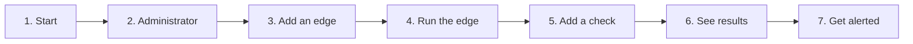

[Docs](README.md) / Start here

# Getting started

From nothing to a check that runs and a notification that arrives.

> **Level:** beginner | **Time:** about 10 minutes | **You need:** Docker



New to the words edge and central? Read [Concepts](concepts.md) first; it takes five minutes.

## 1. Start the stack

```sh
git clone https://github.com/Arylite/netprobe.git
cd netprobe
docker compose up -d
```

The first start builds the images and makes the passwords and keys the stack needs, in volumes
of its own. It is ready when `docker compose ps` shows every service `healthy`.

> [!TIP]
> On a Linux server, [the install script](install.md) does this step in one command and prints
> the setup code of the next one.

## 2. Create the administrator

A new central has no account. It writes a six digit **setup code** in its log:

```sh
docker compose logs central | grep setup_code
```

Open <https://localhost>. The browser warns once, because the proxy signs its certificate with
an authority of its own: accept it. Enter the code, a username, and a password of at least
twelve characters (a short sentence works well). You are signed in.

> [!NOTE]
> The code works once. Ten wrong ones, from anyone, close the page for 15 minutes. If you lose
> it, `docker compose restart central` makes a new one.

## 3. Add an edge

An edge is the program that runs the checks, from the machine where it stands. In the web UI,
open **Edges**, then **Add an edge**, and give it a name such as `paris`.

> [!IMPORTANT]
> The next window shows the edge's **token once**. Copy it now. If you lose it, revoke the edge
> and add another.

## 4. Run the edge

On the machine to measure from, give the edge its token and the address of the central. For a
quick try on the same machine, take the binary from the
[releases](https://github.com/Arylite/netprobe/releases) and give it the certificate of the
proxy's local authority:

```sh
docker compose cp proxy:/data/caddy/pki/authorities/local/root.crt ./root.crt
NETPROBE_TOKEN=np_... netprobe-edge --central https://localhost --ca-file ./root.crt
```

Within a minute, the edge reads **Reporting** in the web UI. For a real machine (a container,
or systemd), see [Edges](edges.md).

## 5. Add a check

Open **Checks**, then **Add a check**. Three good first choices:

| Kind | Target | What it measures |
|---|---|---|
| TCP connect | `example.com:443` | the time to open a connection |
| HTTP request | `https://example.com/health` | the time until the headers arrive; a status of 400 or more fails |
| TLS certificate | `example.com` | the handshake; fails when the certificate expires within 14 days |

Every edge runs every check, at the interval you choose, and learns of a new one within 30
seconds. There are eleven kinds in all: see [Checks](checks.md).

## 6. See the results

**Overview** shows each check on each edge: its state, its latest run, and how it did over the
day. Click a check to see its latest results.

For charts, open Grafana at <https://grafana.localhost> and sign in as `admin`. The password
was made at the first start:

```sh
docker compose exec grafana cat /grafana-secrets/grafana_admin_password
```

More in [Grafana](grafana.md).

## 7. Be told when something breaks

Open **Channels**, then **Add a channel**: a webhook that receives a message when an incident
opens and when it ends. [Alerts](alerting.md) has the exact address to use for Slack, Discord
and others. Press **Test** to see a message arrive.

To watch a real incident, add a check that cannot succeed, such as `example.com:81`. After three
failed runs (the default) an incident opens and your channel hears of it. Remove the check
afterwards.

## What you have now

- A central with its database, web UI and Grafana.
- One edge, one or more checks, and a channel.
- A setup you can grow: more edges, more checks, a real server.

## Where to go next

| If you want to | Read |
|---|---|
| put it on a server with a real name | [Deploying](deploy.md) |
| measure from other places | [Edges](edges.md) |
| lose nothing if the disk dies | [Operating](operations.md#back-up) |

---

Previous: [Concepts](concepts.md) | Next: [Installing with the script](install.md)
