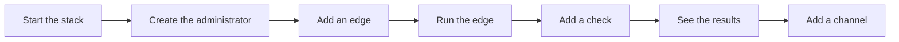

# Getting started

From nothing to a check that runs and a notification that arrives. You need Docker, and
about ten minutes.



## 1. Start the stack

On a Linux machine with Docker, [the install script](install.md) does this step and prints the
setup code of the next one. From a clone:

```sh
git clone https://github.com/Arylite/netprobe.git
cd netprobe
docker compose up -d
```

The first start builds the images, and makes the passwords and keys that the stack
needs in volumes of its own. When `docker compose ps` shows every service `healthy`, it
is up.

## 2. Create the administrator

A new central has no account. Read the setup code that it wrote to its log:

```sh
docker compose logs central | grep setup_code
```

Open <https://localhost>. The proxy answers with a certificate of its own authority,
so the browser warns once: accept it. Give the six digits, a username, and a password
of twelve characters or more (a sentence works well). You are signed in.

The code works once, and ten wrong ones, from anyone, close the page for 15 minutes. If
you lose it, restart the central for a new one: `docker compose restart central`.

## 3. Add an edge

An edge is the machine that runs the checks, from where it stands. In the UI, open
**Edges**, then **Add an edge**, and give it a name such as `paris`. The next window
shows its token **once**: copy it now. If you lose it, revoke the edge and add another.

## 4. Run the edge

On the machine to measure from, with the token and the address of the central. For a
quick try on the same machine, take the binary from the
[releases](https://github.com/Arylite/netprobe/releases) and give it the certificate of the
local authority of the proxy:

```sh
docker compose cp proxy:/data/caddy/pki/authorities/local/root.crt ./root.crt
NETPROBE_TOKEN=np_... netprobe-edge --central https://localhost --ca-file ./root.crt
```

For a real machine, see [Edges](edges.md): a container, or systemd.

## 5. Add a check

**Checks**, then **Add a check**. Start with one of these; [Checks](checks.md) has the eleven kinds
(DNS, TLS certificate, ping, traceroute, NTP clock, banner, closed port, download, domain expiry):

| Kind | Target | It measures |
|---|---|---|
| TCP connect | `example.com:443` | the time to open a connection |
| HTTP request | `https://example.com/health` | the time until the headers arrive; a status of 400 or more fails |
| TLS certificate | `example.com` | the handshake; fails when the certificate expires within 14 days |

Every edge runs every check, at the interval you give. The edge learns of a new check
within 30 seconds.

## 6. See the results

**Overview** shows each check on each edge: its state, its latest run, and how it did
over the day. Click a check for its latest results. For charts, open Grafana at
<https://grafana.localhost>, signing in as `admin` with the password that this prints:

```sh
docker compose exec grafana cat /grafana-secrets/grafana_admin_password
```

See [Grafana](grafana.md).

## 7. Be told when something breaks

**Channels**, then **Add a channel**: a webhook that receives a message when an incident
opens and when it ends. [Alerts](alerting.md) has the address to use for Slack, Discord
and others. Press **Test** to see the message arrive.

To see a real incident, add a check that cannot succeed, such as `example.com:81`. After
three failed runs (the default) an incident opens, and the channel hears of it.

## Next

- [Deploying](deploy.md) to put it on a server with a real name.
- [Operating](operations.md) for backups, which you want before you rely on it.
